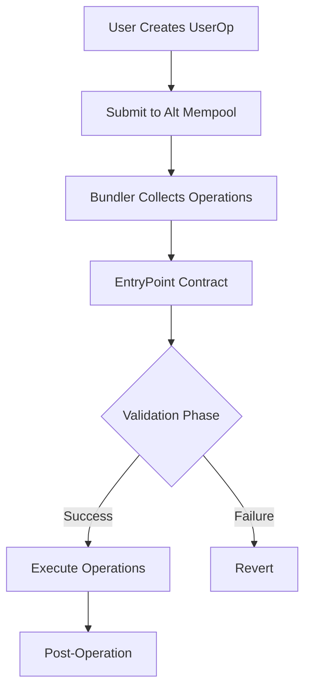

# ERC4337 Account Abstraction using alt mempool

## Overview

ERC-4337 enables smart contract wallets to function like EOAs (Externally Owned Accounts) without consensus layer changes. Instead of traditional transactions, users submit `UserOperations` bundled and executed through a central `EntryPoint` contract.

## Key Components

### 1. UserOperation Structure

```solidity
struct UserOperation {
    address sender;// Smart wallet address
    uint256 nonce;// Unique identifier for tx ordering
    bytes initCode;// For wallet deployment (if not deployed)
    bytes callData;// The actual transaction data
    uint256 callGasLimit;// Gas limit for execution
    uint256 verificationGasLimit;// Gas for validation phase
    uint256 preVerificationGas;// Gas overhead compensation
    uint256 maxFeePerGas;// Max gas price willing to pay
    uint256 maxPriorityFeePerGas;// Max priority fee
    bytes paymasterAndData;// Optional paymaster configuration
    bytes signature;// Wallet authorization signature
}
```

### 2. Transaction Flow



## Smart Wallet Implementation Requirements

### 1. Core Interface

```solidity
interface ISmartWallet {
		// Required - Main validation function
    function validateUserOp(
        UserOperation calldata userOp,
        bytes32 userOpHash,
        uint256 missingAccountFunds
    ) external returns (uint256 validationData);

		// Optional - Custom execution logic
    function executeUserOp(
        UserOperation calldata op,
        bytes32 userOpHash
    ) external;
}
```

### 2. Essential Functions

## Validation Implementation

```solidity
contract SmartWallet is ISmartWallet {
    address public owner;
    IEntryPoint public immutable entryPoint;

    function validateUserOp(
        UserOperation calldata userOp,
        bytes32 userOpHash,
        uint256 missingAccountFunds
    ) external returns (uint256 validationData) {
				// 1. Verify caller is EntryPoint
        require(msg.sender == address(entryPoint), "only EntryPoint");

				// 2. Verify signature
        bytes32 hash = userOpHash.toEthSignedMessageHash();
        if (!_validateSignature(userOp, hash)) {
            return SIG_VALIDATION_FAILED;
        }

				// 3. Pay pre-fund if needed
        if (missingAccountFunds > 0) {
            (bool success,) = payable(msg.sender).call{value: missingAccountFunds}("");
            require(success, "wallet: failed to pay prefund");
        }

        return 0;// Validation successful
    }

    function _validateSignature(
        UserOperation calldata userOp,
        bytes32 hash
    ) internal view returns (bool) {
        bytes32 recoveredAddr = ECDSA.recover(hash, userOp.signature);
        return recoveredAddr == owner;
    }
}

```

## Execution Handler

```solidity
contract SmartWallet {
    function executeUserOp(
        UserOperation calldata op,
        bytes32 userOpHash
    ) external {
        require(msg.sender == address(entryPoint), "only EntryPoint");
        _execute(op.callData);
    }

    function _execute(bytes memory data) internal {
        (address target, uint256 value, bytes memory callData) =
            abi.decode(data, (address, uint256, bytes));

        (bool success, bytes memory result) = target.call{value: value}(callData);
        require(success, "wallet: execution failed");
    }
}

```

### 3. Security Features

## Nonce Management

```solidity
contract SmartWallet {
    mapping(uint192 => uint64) public nonces;

    function getNonce(uint192 key) public view returns (uint256) {
        return (uint256(key) << 64) | nonces[key];
    }

    function _validateNonce(UserOperation calldata userOp) internal {
        uint192 key = uint192(userOp.nonce >> 64);
        uint64 seq = uint64(userOp.nonce);
        require(nonces[key] == seq, "wallet: invalid nonce");
        nonces[key]++;
    }
}

```

## Replay Protection

```solidity
contract SmartWallet {
    function _validateUserOpHash(
        bytes32 userOpHash
    ) internal view returns (bool) {
        bytes32 domain = keccak256(abi.encode(
            "EIP4337",
            block.chainid,
            address(entryPoint)
        ));
        return userOpHash == keccak256(abi.encode(domain, msg.sender));
    }
}

```

## Advanced Features

### 1. Multi-Signature Support

```solidity
contract MultiSigWallet is SmartWallet {
    mapping(address => bool) public isOwner;
    uint256 public threshold;

    function validateUserOp(
        UserOperation calldata userOp,
        bytes32 userOpHash,
        uint256 missingAccountFunds
    ) external override returns (uint256) {
// Verify multiple signatures
        (bytes[] memory signatures) = abi.decode(userOp.signature, (bytes[]));
        require(
            _validateMultiSig(userOpHash, signatures),
            "invalid multisig"
        );

// Handle prefund
        if (missingAccountFunds > 0) {
            (bool success,) = payable(msg.sender).call{value: missingAccountFunds}("");
            require(success, "wallet: failed to pay prefund");
        }

        return 0;
    }

    function _validateMultiSig(
        bytes32 hash,
        bytes[] memory signatures
    ) internal view returns (bool) {
        require(signatures.length >= threshold, "not enough signatures");

        address[] memory recovered = new address[](signatures.length);
        for (uint i = 0; i < signatures.length; i++) {
            address signer = ECDSA.recover(hash, signatures[i]);
            require(isOwner[signer], "invalid signer");

				// Ensure no duplicate signatures
            for (uint j = 0; j < i; j++) {
                require(recovered[j] != signer, "duplicate signer");
            }
            recovered[i] = signer;
        }
        return true;
    }
}

```

### 2. Social Recovery

```solidity
contract RecoverableWallet is SmartWallet {
    mapping(address => bool) public guardians;
    uint256 public guardiansThreshold;
    uint256 public recoveryPeriod;

    struct RecoveryRequest {
        address newOwner;
        uint256 timestamp;
        mapping(address => bool) hasApproved;
        uint256 approvals;
    }

    RecoveryRequest public activeRecovery;

    function initiateRecovery(address newOwner) external {
        require(guardians[msg.sender], "only guardian");
        activeRecovery.newOwner = newOwner;
        activeRecovery.timestamp = block.timestamp;
        activeRecovery.approvals = 1;
        activeRecovery.hasApproved[msg.sender] = true;
    }

    function approveRecovery() external {
        require(guardians[msg.sender], "only guardian");
        require(!activeRecovery.hasApproved[msg.sender], "already approved");

        activeRecovery.approvals++;
        activeRecovery.hasApproved[msg.sender] = true;

        if (activeRecovery.approvals >= guardiansThreshold &&
            block.timestamp >= activeRecovery.timestamp + recoveryPeriod) {
            owner = activeRecovery.newOwner;
        }
    }
}
```

### 3. Gas Payment Abstraction

```solidity
contract PaymasterCompatibleWallet is SmartWallet {
    function validatePaymasterUserOp(
        UserOperation calldata userOp,
        bytes32 userOpHash,
        uint256 maxCost
    ) external returns (bytes memory context, uint256 validationData) {
// Verify paymaster is approved
        address paymaster = address(bytes20(userOp.paymasterAndData[:20]));
        require(_isApprovedPaymaster(paymaster), "unapproved paymaster");

// Custom validation logic// Return context for postOp
        return (abi.encode(maxCost), 0);
    }

    function postOp(
        IPaymaster.PostOpMode mode,
        bytes calldata context,
        uint256 actualGasCost
    ) external {
        require(msg.sender == address(entryPoint), "only EntryPoint");
// Handle post-operation logic
        if (mode == IPaymaster.PostOpMode.opSucceeded) {
// Handle successful operation
        }
    }
}
```

## Best Practices

1. **Gas Optimization**
    - Use assembly for signature verification
    - Minimize storage reads/writes
    - Optimize calldata encoding
2. **Security Measures**
    - Implement proper access control
    - Include reentrancy protection
    - Validate all parameters
3. **Upgradability**
    - Consider proxy patterns
    - Plan for future upgrades
    - Include version control
4. **Testing**
    - Test all validation paths
    - Verify gas estimations
    - Simulate various scenarios

## Common Pitfalls

1. **Incorrect Nonce Management**
    - Not handling nonce collisions
    - Missing sequence validation
2. **Signature Verification**
    - Not including chain ID
    - Missing replay protection
3. **Gas Handling**
    - Insufficient pre-fund calculation
    - Missing gas limit checks
4. **Integration Issues**
    - Incompatible paymaster integration
    - Incorrect EntryPoint interaction