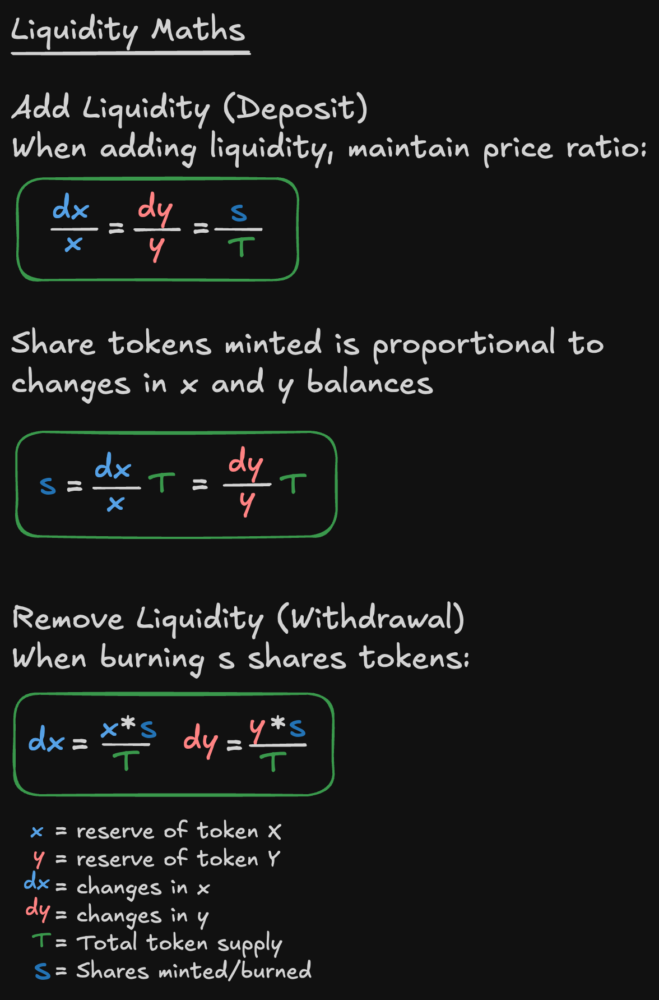
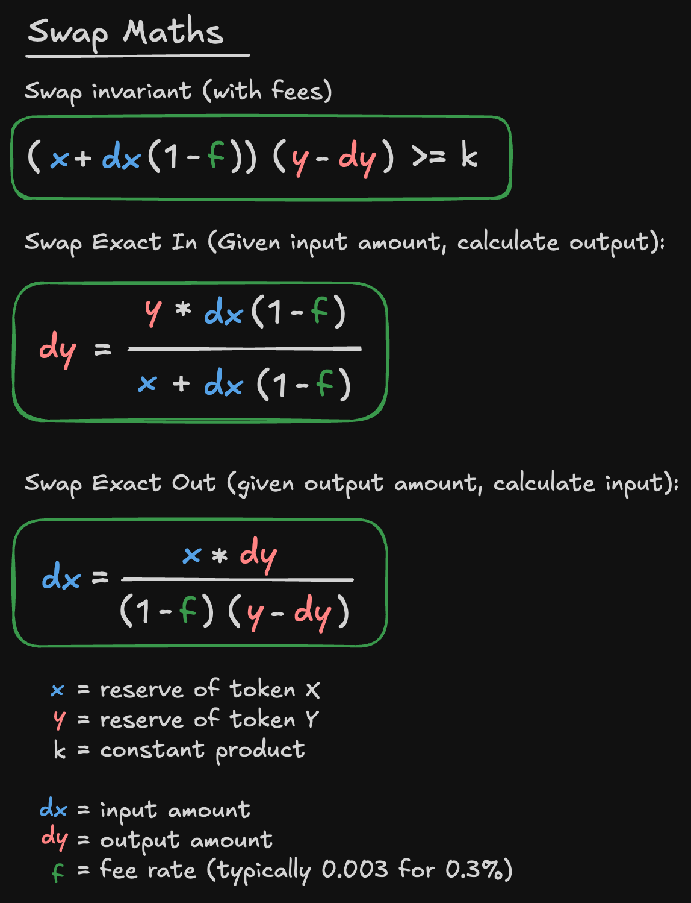

# Uniswap V2 Math Quick Reference

Quick reference sheets for Uniswap V2 liquidity and swap mathematics.

## Overview

Uniswap V2 uses a constant product AMM model. Despite being older tech, it still holds significant TVL due to its simple and robust design.
Liquidity Math

Covers adding and removing liquidity while maintaining price ratios.

Swap Math

Covers swap calculations with fees for exact input and exact output scenarios.
